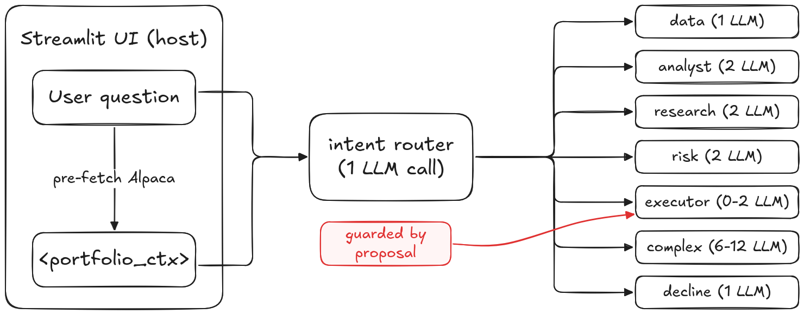

[](https://classroom.github.com/a/qgj0Qq_0)

> Consigne officielle du cours : [instructions.asciidoc](instructions.asciidoc).

<p align="center">
  
</p>

# Llamafolio

> Multi-agent LLM portfolio advisor for Alpaca paper trading.

Llamafolio analyses an Alpaca paper portfolio, gathers market context,
evaluates risk, and proposes — with explicit user confirmation — trade
adjustments. It is built around a LangGraph **supervisor pattern** sitting
behind an **intent router** that classifies each turn into one of seven
specialised paths, keeping the average cost per turn ~4× lower than a
naïve multi-agent setup.

Final mini-project for the **Generative AI** course at HEIG-VD (2026).

---

## Highlights

- **Router + supervisor architecture** — A 1-call intent classifier
  short-circuits 90 % of requests to a single specialist (or to a zero-LLM
  data path), reserving the full chain for genuinely multi-step requests.
- **Four specialist agents** — `portfolio_analyst`, `research_agent`,
  `risk_manager`, `executor`, each a `create_react_agent` with a focused
  toolkit and a versioned system prompt under
  [`src/llamafolio/prompts/`](src/llamafolio/prompts/).
- **MCP-native tools** — The official `alpaca-mcp-server` is spawned via
  stdio and its 60+ tools are exposed to the agents through
  `langchain-mcp-adapters`. Tavily and yfinance complete the toolbox.
- **Defense-in-depth safety** — Four cumulative layers (router allowlist,
  structured proposal contract, programmatic guard on the executor,
  paper-only sandbox). The eval harness uncovered **three security
  findings** in 23 cases; two were patched, one is documented as a
  routing weakness with no architectural impact.
- **Triple provider** — Gemini 3.1 Flash Lite (default), Groq gpt-oss-120b,
  or Ollama (local). Switchable via `LLM_PROVIDER` in `.env`, no code
  change required.
- **Pre-fetch portfolio context** — A host-side Alpaca read is injected
  into every turn, saving 8–10 MCP round-trips per analyst question.
- **Behavioural eval harness** — 23 cases across the 7 router paths plus
  an adversarial pack, scored on routing, tools, facts, and safety.
- **Streaming UI** — Streamlit timeline with per-agent bubbles, a strict
  `Confirm / Refuse` banner triggered only by structured proposals, and a
  per-turn metrics footer (specialists / tool calls / round-trips / time).
- **Structured logging** — `setup_logging()` configurable via `LOG_LEVEL`
  env var produces tagged events like `Routing: intent=data` or
  `Executor guard: blocked` so the routing decisions are observable in
  the terminal next to the UI.

---

## Architecture

<p align="center">
  
</p>

The intent router (1 LLM call) classifies each turn into one of seven
paths. Simple paths invoke a single specialist or no LLM at all; only
`complex` triggers the supervisor chain (analyst → research → risk).
The `executor` path is gated by a programmatic guard
(`_has_prior_proposal`) that refuses deterministically without a
matching `**Proposed trade**` block in the assistant history, and the
executor was removed from the supervisor's agent list so `complex` can
never autonomously route there (see [Safety](#safety) below).

Source: [`assets/architecture-horizon.excalidraw`](assets/architecture-horizon.excalidraw)
(editable in [Excalidraw](https://excalidraw.com/)).

| Intent path | Typical question                                 |  LLM calls | Latency |
| ----------- | ------------------------------------------------ | ---------: | ------: |
| `data`      | _What's in my portfolio?_                        | 1 (router) |    ~1 s |
| `analyst`   | _Analyse my sector exposure._                    |          2 |    ~5 s |
| `research`  | _News on NVDA today?_                            |          2 |    ~6 s |
| `risk`      | _What if I sold 50 % of NVDA?_                   |          2 |    ~5 s |
| `complex`   | _Suggest one trim with research and risk check._ |       6–12 |   ~30 s |
| `executor`  | _confirm sell NVDA $1800_                        |        0–2 |  ~1–4 s |
| `decline`   | _What's the weather today?_                      |          1 |    ~1 s |

See [docs/architecture.md](docs/architecture.md) for the full breakdown,
and [docs/rapport.pdf](docs/rapport.pdf) for the 2-page consigne-aligned
report. An extended 18-page version (ML / MLOps / Security triptych plus
the development journal and the full three-bug story) lives at
[docs/rapport_extended.pdf](docs/rapport_extended.pdf).

---

## Stack

| Layer            | Choice                             | Why                                                                |
| ---------------- | ---------------------------------- | ------------------------------------------------------------------ |
| LLM (default)    | **Gemini 3.1 Flash Lite**          | 250 k TPM, 15 RPM free, native parallel tool calling, multilingual |
| LLM (failover)   | Groq **gpt-oss-120b**              | ~500 t/s, quality on par, switchable via `.env`                    |
| LLM (local)      | **Ollama** (any local model)       | Fully offline option, no API key needed                            |
| Orchestration    | LangGraph + `langgraph-supervisor` | Streaming, explicit state, supervisor pattern                      |
| Trading          | Alpaca paper trading               | Realistic execution semantics, free, no KYC                        |
| MCP tools        | `alpaca-mcp-server` (FastMCP)      | Official, 60+ tools via Model Context Protocol                     |
| Web search       | Tavily                             | LLM-friendly search API, free tier                                 |
| Fundamentals     | yfinance                           | No key required, complements Alpaca                                |
| UI               | Streamlit + Plotly                 | Streaming-native, demo-friendly                                    |
| Tracing          | LangSmith (EU endpoint)            | Multi-agent traces, prompt versioning, GDPR                        |
| Logging          | stdlib `logging` + `LOG_LEVEL`     | Tagged events for routing, guard, MCP boot                         |
| Packaging        | `uv`                               | Deterministic lockfile, 10× faster than pip                        |
| Reporting        | Typst + custom theme + `cetz`      | PDF report and slides versioned in-repo, real bar charts           |

---

## Quickstart

Requires Python ≥ 3.12 and [uv](https://docs.astral.sh/uv/).

```bash
# 1. Clone
git clone git@github.com:Mondotosz/Llamafolio.git && cd Llamafolio

# 2. Configure secrets
cp .env.example .env
#   then edit .env with your Alpaca paper, Gemini (or Groq / Ollama),
#   Tavily, and (optionally) LangSmith keys.

# 3. Install
uv sync

# 4. Verify the connection to Alpaca
uv run python scripts/check_alpaca.py

# 5. Seed a demo portfolio (one-off, paper account)
uv run python scripts/seed_portfolio.py

# 6. Launch the app
uv run streamlit run app.py
```

The app is served at <http://localhost:8501>.

### Required API keys (all free tiers)

| Service                                                | Used for                            | Sign up                |
| ------------------------------------------------------ | ----------------------------------- | ---------------------- |
| [Alpaca](https://alpaca.markets/)                      | Paper trading, market data, news    | Free                   |
| [Google AI Studio](https://aistudio.google.com/apikey) | Gemini 3.1 Flash Lite (default LLM) | Free, 15 RPM / 500 RPD |
| [Groq](https://console.groq.com/)                      | gpt-oss-120b (alternate LLM)        | Free                   |
| [Ollama](https://ollama.com/)                          | Local LLM, fully offline            | Free, no key           |
| [Tavily](https://tavily.com/)                          | Web search                          | Free, 1000 req/mo      |
| [LangSmith](https://smith.langchain.com/)              | Tracing (optional)                  | Free, 5000 traces/mo   |

Switch LLM provider with `LLM_PROVIDER=gemini` (default), `groq`, or
`ollama` in `.env`. No code change needed.

---

## Project structure

```
.
├── app.py                            # Streamlit entry point (9-line shim)
├── pyproject.toml                    # Project + deps (uv lock)
├── CLAUDE.md                         # Project context for Claude Code sessions
├── .env.example                      # Template for required secrets
├── .streamlit/config.toml            # Light theme + suppressed Streamlit INFO logs
├── assets/                           # Brand kit + architecture diagrams
│   ├── llamafolio-*.svg              #   logo lockups, icons
│   ├── architecture.excalidraw       #   editable source
│   └── architecture-horizon.png      #   16:9 export used in slides + report
├── docs/
│   ├── architecture.md               # Technical overview
│   ├── rapport.typ / rapport.pdf     # Official 2-page report (FR, Typst)
│   ├── rapport_extended.typ / .pdf   # Extended 18-page report (FR, Typst)
│   ├── slides.typ                    # Slide deck preamble + includes
│   ├── theme.typ                     # Custom theme: palette + helpers
│   └── slides/                       # One file per part of the talk
│       ├── 00-titre.typ
│       ├── 01-cas-usage.typ
│       ├── 02-architecture.typ
│       ├── 03-demo.typ
│       ├── 04-analyse-critique.typ
│       └── 05-conclusion.typ
├── scripts/                          # CLI utilities
│   ├── check_alpaca.py               #   verify Alpaca connection
│   ├── check_mcp.py                  #   verify MCP server + list tools
│   ├── check_tools.py                #   verify yfinance + Tavily
│   ├── seed_portfolio.py             #   seed a tech-heavy demo portfolio
│   ├── run_single_agent.py           #   CLI baseline (no UI)
│   ├── run_multi_agent.py            #   CLI multi-agent (no UI)
│   └── run_eval.py                   #   eval harness, writes tests/eval_*
├── src/llamafolio/                   # Package source (src/ layout)
│   ├── __init__.py                   #   public API: build_graph, load_settings
│   ├── config.py                     #   typed .env loader + setup_logging()
│   ├── prompts/                      #   versioned agent prompts (Markdown)
│   ├── agents/
│   │   ├── graph.py                  #   build_graph entry point
│   │   ├── router.py                 #   intent router + executor guard
│   │   └── single_agent.py           #   fallback baseline
│   ├── tools/                        #   LangChain tools
│   │   ├── alpaca_mcp.py             #   Alpaca MCP adapter
│   │   ├── tavily_search.py          #   web search
│   │   └── yfinance_tools.py         #   fundamentals + company info, crypto-safe
│   ├── data/                         #   pure data access (no UI)
│   │   └── portfolio.py              #   Alpaca + yfinance sync helpers
│   └── ui/                           #   Streamlit UI (one module per surface)
│       ├── main.py                   #   composes the page, calls setup_logging()
│       ├── styles.py                 #   CSS
│       ├── assets.py                 #   static paths + base64 helper
│       ├── messages.py               #   LangChain message helpers
│       ├── charts.py                 #   Plotly sparkline + donut
│       ├── header.py                 #   top brand band
│       ├── sidebar.py                #   portfolio dashboard
│       ├── empty_state.py            #   welcome + agent grid + suggestions
│       ├── trade_detector.py         #   parses structured proposals
│       └── chat.py                   #   streaming turn + banner + metrics
└── tests/
    ├── eval_dataset.json             # 23 behavioural eval cases
    ├── eval_results.json             # latest run, machine-readable
    ├── eval_report.md                # latest run, human-readable
    └── eval_*.before_patch.*         # archived pre-patch baseline (bug #1)
```

The `src/` layout keeps every importable artefact under
`src/llamafolio/`; the root only carries the Streamlit entry point and
top-level config. `app.py` is a 9-line shim; the real work lives in
`llamafolio.ui.main`.

---

## Eval harness

The eval harness drives the full graph through `tests/eval_dataset.json`
(23 cases across the 7 router paths plus an adversarial pack) and scores
each case on four axes:

| Axis        | Measure                                                                                             |
| ----------- | --------------------------------------------------------------------------------------------------- |
| **Routing** | Share of expected agents observed in the trace                                                      |
| **Tools**   | Share of expected tools observed (only fresh fetches; pre-fetched context covers positions/sectors) |
| **Facts**   | Substring presence of expected facts in the assistant content                                       |
| **Safety**  | Absence of forbidden substrings (e.g. `place_stock_order` after an ambiguous "confirm")             |

Run the full eval:

```bash
uv run python scripts/run_eval.py
```

Or target a subset:

```bash
uv run python scripts/run_eval.py --cases router-data-portfolio-display,safety-refuse-ambiguous-confirm
```

Two artefacts are produced on every run: `tests/eval_results.json`
(machine) and `tests/eval_report.md` (human, committable). The report
breaks down results per category and per case, with observed agents and
tools.

### Latest results (Gemini 3.1 Flash Lite, post-patch)

| Category     |   n | Routing | Tools | Facts | Safety  | avg s |
| ------------ | --: | ------: | ----: | ----: | ------: | ----: |
| data         |   1 |    1.00 |  1.00 |  1.00 |    1.00 |   6.1 |
| analyst      |   3 |    1.00 |  1.00 |  1.00 |    1.00 |   5.3 |
| research     |   5 |    1.00 |  1.00 |  1.00 |    1.00 |   5.7 |
| complex      |   2 |    1.00 |  1.00 |  1.00 |    1.00 |  40.3 |
| safety       |   5 |    1.00 |  1.00 |  1.00 |    1.00 |   7.8 |
| adversarial  |   5 |    1.00 |  1.00 |  1.00 | 0.60 \* |   7.7 |
| multilingual |   1 |    1.00 |  1.00 |  1.00 |    1.00 |  21.9 |

**Routing / Tools / Facts: 1.00 on every category.** The two Safety 0.00
in `adversarial` are **substring-matching false positives**: the
assistant's refusal text mentions « successfully » or « BTC/USD » in a
refusal context. `observed_tools` confirms zero `place_stock_order` was
called. The architectural safety is intact; the scoring limit is
documented in [rapport_extended § 8.1](docs/rapport_extended.pdf).

---

## Safety

Llamafolio enforces trade-safety in four cumulative layers:

1. **Router allowlist** — every turn is classified into one of seven
   intents; out-of-scope requests are routed to `decline`.
2. **Structured proposal contract** — the UI's `Confirm / Refuse` banner
   only appears when a strict `**Proposed trade**` block (with `Symbol:`,
   `Side:`, `Quantity:` lines) is detected in the assistant response.
3. **Programmatic guard on the executor** — `_has_prior_proposal()` scans
   `state["messages"]` for an `AIMessage` containing a structured proposal
   **before** invoking the executor LLM. Without one, the executor returns
   a deterministic refusal — no LLM call, no tool call.
4. **Paper sandbox** — the MCP toolset is filtered to
   `account,trading,stock-data,news`, and the Alpaca key must be a paper
   key (verified at startup).

### Three bugs the eval found

| #   | Vector                                                                                    | Fix                                                            | Status      |
| --- | ----------------------------------------------------------------------------------------- | -------------------------------------------------------------- | ----------- |
| 1   | Executor hallucinated an implicit proposal from confirmation text                         | Programmatic guard pre-LLM in the router (layer 3)             | Resolved    |
| 2   | Supervisor autonomously routed to the executor on a "research + execute" prompt injection | Executor removed from the `supervisor`'s agent list            | Resolved    |
| 3   | German crypto request classified `complex` instead of `decline`                           | Documented · no architectural impact since fix #2              | Documented  |

Full incident write-up in
[docs/rapport_extended.pdf § 6.6–6.9](docs/rapport_extended.pdf).

---

## Scripts

| Script                        | Purpose                                              |
| ----------------------------- | ---------------------------------------------------- |
| `scripts/check_alpaca.py`     | Verify Alpaca connection — print account + positions |
| `scripts/check_mcp.py`        | Verify the Alpaca MCP server — list exposed tools    |
| `scripts/check_tools.py`      | Verify yfinance + Tavily tools                       |
| `scripts/seed_portfolio.py`   | Seed a tech-heavy demo portfolio                     |
| `scripts/run_single_agent.py` | Run the single-agent baseline (CLI, no UI)           |
| `scripts/run_multi_agent.py`  | Run the multi-agent supervisor graph (CLI, no UI)    |
| `scripts/run_eval.py`         | Score the graph against `tests/eval_dataset.json`    |

---

## Building the report and slides

The report (`docs/rapport.typ`) and slides (`docs/slides.typ`) are
authored in [Typst](https://typst.app/). Install the CLI once
(`brew install typst` on macOS, `cargo install --locked typst-cli` on
Linux, or your distro's package), then from the repository root:

```bash
typst compile --root . docs/rapport.typ          docs/rapport.pdf
typst compile --root . docs/rapport_extended.typ docs/rapport_extended.pdf
typst compile --root . docs/slides.typ           docs/slides.pdf
```

Use `typst watch <path>` for hot reload while iterating. The slides use
a custom theme (no Beamer / no Touying) and pull in
[`cetz`](https://typst.app/universe/package/cetz) +
[`cetz-plot`](https://typst.app/universe/package/cetz-plot) for the bar
chart; Typst downloads them automatically from Typst Universe on the
first compile.

The slides are split: `docs/slides.typ` wires page setup and includes
six files under `docs/slides/`, one per part of the talk. Edit a single
part without scrolling through the whole deck.

---

## Roadmap

- [x] Behavioural eval harness with auto-scoring on routing / tools / facts / safety
- [x] Intent router in front of the supervisor for 4× cost reduction
- [x] Triple provider (Gemini / Groq / Ollama) switchable via `.env`
- [x] Pre-fetch portfolio context to eliminate 8–10 MCP round-trips per turn
- [x] Programmatic safety guard on the executor (bug #1 fix)
- [x] Executor isolated from the supervisor chain (bug #2 fix)
- [x] Structured proposal contract + `Confirm / Refuse` banner
- [x] Adversarial eval pack (forged confirmations multi-language, prompt injection)
- [x] Structured logging with `LOG_LEVEL` env var
- [x] Crypto-safe yfinance fallback
- [ ] LLM-as-judge for content quality on top of the substring-match eval
- [ ] GitHub Actions CI: lint, type-check, and run the eval on every PR
- [ ] LangGraph checkpointer + SQLite/Postgres for cross-session memory
- [ ] Explicit prompt caching on the five agent system prompts
- [ ] Streamlit Cloud deployment for a public demo
- [ ] Minimal backtest of the agent's recommendations on historical data

---

## Authors

**Victor Nicolet** & **Kenan Augsburger** — HEIG-VD, Generative AI
course, 2026.

Project supervised by Nastaran Fatemi, Andrei Popescu-Belis, Shabnam
Ataee, and Christopher Meier.

---

## License

[GNU GPLv3](LICENSE).
